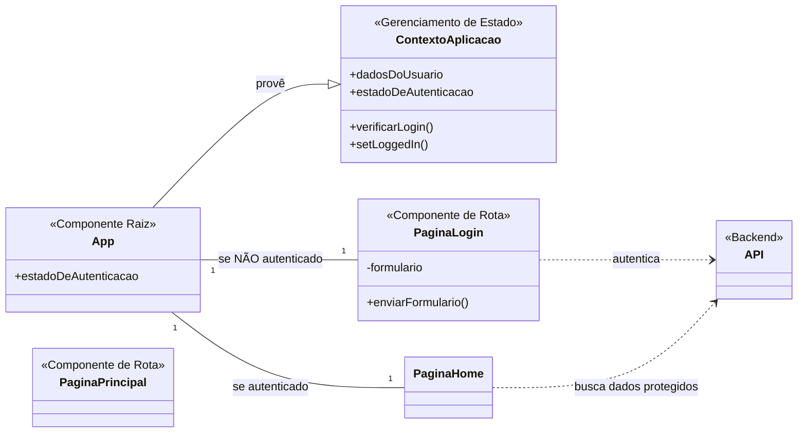

# Portal PPTM

## Visão Geral

O Portal PPTM é uma aplicação web interna desenvolvida para o gerenciamento centralizado de ativos, pessoas, contratos e processos da área de Operações da PPTM. Esta ferramenta foi projetada para otimizar o fluxo de trabalho e fornecer uma visão unificada dos principais dados operacionais e administrativos da empresa.

**Aviso:** Esta aplicação é de uso exclusivo do ambiente corporativo e deve ser executada apenas na rede interna da Energia Pecém. Ela não é pública e não deve ser acessada de fora da rede.

## Tecnologias Utilizadas

### Frontend

- **React:** Biblioteca JavaScript para a interface de usuário.
- **Vite:** Ferramenta de build para um ambiente de desenvolvimento rápido.
- **JavaScript/JSX:** Linguagem de programação.
- **CSS:** Linguagem de estilização.

### Backend

- **Node.js:** Ambiente de execução.
- **Express.js:** Framework web para construção da API.
- **SQL Server:** Banco de dados relacional para persistência de dados.

## Instalação e Execução

### Pré-requisitos

- [Node.js](https://nodejs.org/en/) (versão LTS)
- `npm` (gerenciador de pacotes do Node.js)
- Uma instância do **SQL Server** com as credenciais de acesso e a string de conexão.

### Passos de Configuração

1.  **Clone o repositório:**

    ```bash
    git clone [https://github.com/seu-usuario/app-portal.git](https://github.com/seu-usuario/app-portal.git)
    cd app-portal
    ```

2.  **Instale as dependências:**

    ```bash
    npm install
    ```

3.  **Variáveis de Ambiente:**
    Crie um arquivo `.env` na raiz do projeto e configure a URL da API, além da string de conexão do banco de dados.

    ```env
    VITE_APP_API_BASE_URL=[http://portalpptm.energiapecem.local:3000/api](http://portalpptm.energiapecem.local:3000/api)
    SQL_SERVER_CONNECTION_STRING=Server=tcp:[seu_servidor].database.windows.net,1433;Initial Catalog=SeuBanco;Persist Security Info=False;User ID=seu_usuario;Password=sua_senha;MultipleActiveResultSets=False;Encrypt=True;TrustServerCertificate=False;Connection Timeout=30;
    ```

    _**Nota:** Substitua o valor de `SQL_SERVER_CONNECTION_STRING` pela sua string de conexão real do SQL Server._

4.  **Inicie o Servidor de Desenvolvimento:**
    ```bash
    npm run dev
    ```
    A aplicação estará disponível em `http://localhost:5173`.

## Arquitetura Frontend da Aplicação

A aplicação utiliza uma arquitetura baseada em componentes React. A lógica de autenticação e navegação condicional é centralizada no componente raiz `App`, que gerencia o estado da aplicação através de um Contexto global.


